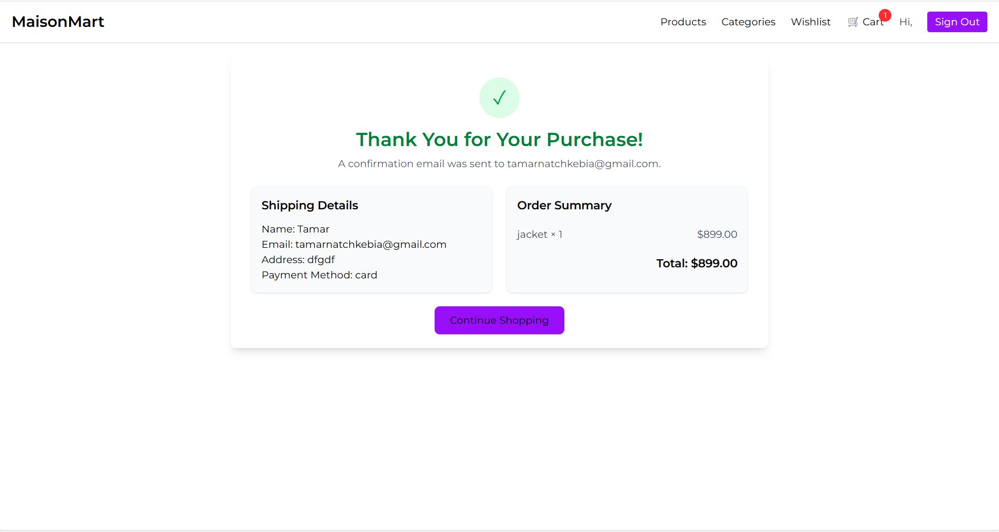

# MaisonMart 🛍️

MaisonMart is a modern shopping web application built with React that allows users to browse products, explore categories, manage a cart and wishlist, and authenticate users using a real external API.

The app focuses on clean UI, smooth navigation, and a realistic e-commerce experience.

---

## 🚀 Live Demo
👉 https://maisonmart-store.netlify.app/

---

## ✨ Features

- Browse products and product details
- View and explore product categories
- Add/remove items from cart
- Wishlist functionality
- User authentication (login & signup)
- Responsive navigation bar with cart & wishlist counters
- FAQ section and full footer
- Clean and modern UI with Tailwind CSS

---

## 🖼️ Screenshots

### Home Page


### Purchase / Products Page


### Checkout / Cart Page


---

## 🛠 Tech Stack

- React
- React Router
- Axios
- Context API
- Tailwind CSS
- Vite
- External REST API (EscuelaJS)

---

## 🔌 API Used

This project uses the **EscuelaJS Fake Store API**:

- https://api.escuelajs.co/api/v1

Endpoints used:
- Authentication
- Products
- Categories
- User creation
- Profile data

⚠️ No API keys are required.

---

## 📦 Installation & Setup

Clone the repository:

```bash
git clone https://github.com/tamar-natchkebia/shopping-app-.git
